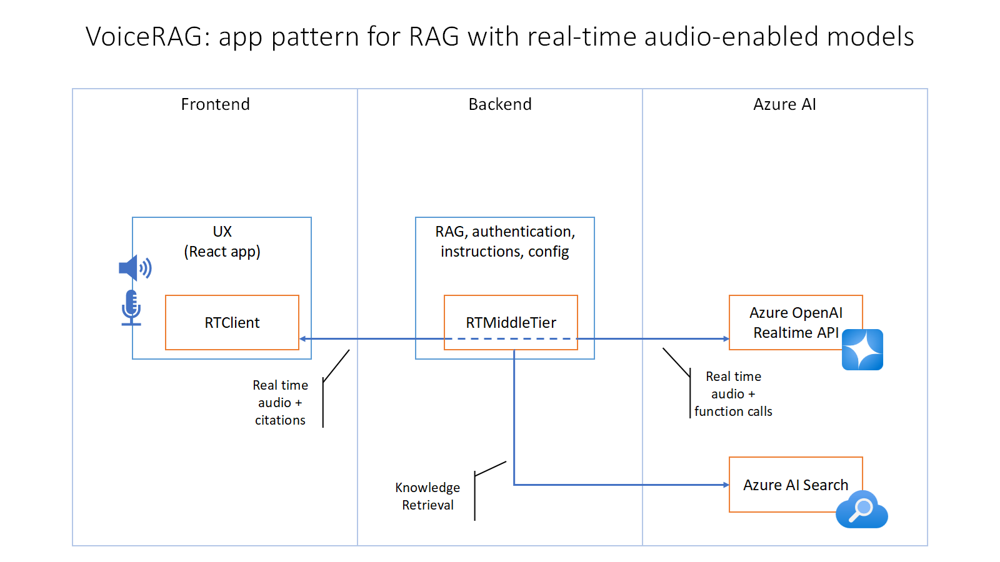
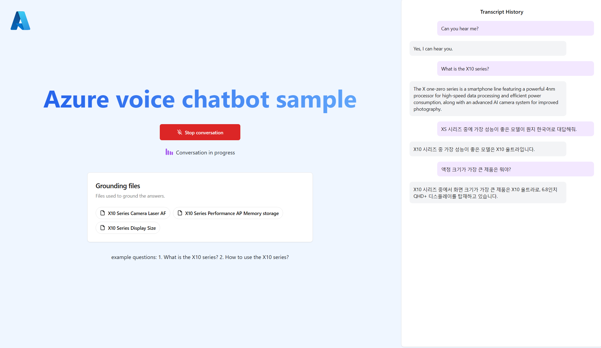

# aoai-voice-chat-sample

This project is a simplified fork of [VoiceRAG: An Application Pattern for RAG + Voice Using Azure AI Search and the GPT-4o Realtime API for Audio](https://github.com/Azure-Samples/aisearch-openai-rag-audio). 

## Additional Features

* **Transcription History UI**: Provides a transcription history interface that was not included in the original repository. This feature allows you to review the conversation history between the user and the voice models.
Note: The JSON key values differ between Realtime and Voice Agent; please check this when integrating.
```python
# app/frontend/src/types.ts
export type ResponseDone = {
    type: "response.done";
    event_id: string;
    response: {
        id: string;
        output: { id: string; content?: { transcript: string; text: string, type: string }[] }[];
    };
};
# app/frontend/src/App.tsx
        onReceivedResponseDone: message => {
            //content.text for voice agent || content.transcript for aoai realtime api
            const transcript = message.response.output
                .map(output => output.content?.map(content => content.text || content.transcript || "").join(" "))
                .join(" ");
```
* **Voice Agent Integration**: When integrating with Azure Voice Agent, please be aware that the endpoint URL and the format of voice messages sent through the WebSocket session differ from the Realtime model. Make sure to verify this in the code.
```python
# app/backend/.env
## Voice Agent
AZURE_VOICEAGENT_ENDPOINT=wss://
AZURE_VOICEAGENT_API_KEY=
AZURE_VOICEAGENT_VOICE_CHOICE=en-US-Aria:DragonHDLatestNeural
# for voice agent api version needs to be set as 2025-05-01-preview 
AZURE_VOICEAGENT_API_VERSION=2025-05-01-preview
```
* **Synthetic data based RAG (Retrieval Augmented Generation)**: The app leverages Azure AI Search to answer questions from a synthetic knowledge base. Retrieved documents are sent to the GPT-4o Realtime API or Voice Agent for response generation.

* **Instruction example for domain specific pronunciation**: Includes examples demonstrating how to use prompt instructions in the GPT-4o Realtime API to fine-tune the pronunciation of specific words or phrases.
```python
# app/backend/app.py
rtmt.system_message = """
        ...
        Special Instructions:
        When mentioning the model "X10," or "X10" always pronounce it as "X one-zero", not "ten." For example, "The X one-zero device is optimized for high-speed processing." Keep this pronunciation consistent throughout the discussion.
        Ensure this pronunciation is consistent throughout the conversation.
    """.strip()
```
* **VAD(Voice Activity Detection) configuration example**: This application provides examples for configuring VAD settings with the GPT-4o Realtime API, allowing you to control when the voice agent starts and stops speaking, as well as how to handle silence in the audio stream. Generally, server_vad offers faster response times and lower latency, making it ideal for most real-time voice applications. On the other hand, if natural conversational flow is crucial, semantic_vad provides more accurate detection of when a speaker has finished talking. However, it may result in slower response times. It's recommended to experiment with both options to determine the optimal setting based on your use case. For Voice Agent, VAD settings are configured differently from the Realtime model. I will provide additional guidance once the basic Voice Agent configuration is completed.

```python
# app/backend/.env
VAD_TYPE=<choose one: server_vad, semantic_vad>
# app/backend/rtmt.py
      self.vad_type = vad_type
        if vad_type == "server_vad":
            self.default_vad_config = {
                "type": "server_vad",
                "threshold": 0.5,
                "prefix_padding_ms": 300,
                "silence_duration_ms": 500,
                "create_response": True,
            }
        else:
            self.default_vad_config = {
                "type": "semantic_vad",
                "eagerness": "auto", # low, medium, high, auto
                "create_response": True
            }

```


* **input_audio_transcription Configuration**: Includes configuration options for different input audio transcription models. The app supports both whisper-1 and gpt-4o-mini-transcribe for transcribing audio input. 

```python
# app/backend/.env
INPUT_AUDIO_TRANSCRIPTION=<choose one: whisper-1, gpt-4o-mini-transcribe>
# app/backend/rtmt.py
         if self.input_audio_transcription is not None:
            session["input_audio_transcription"] = {
                  "model": self.input_audio_transcription
            }

```
### Architecture Diagram

The `RTClient` in the frontend receives the audio input, sends that to the Python backend which uses an `RTMiddleTier` object to interface with the Azure OpenAI real-time API, and includes a tool for searching Azure AI Search.




## Getting Started

### Local environment

1. Install the required tools:
   * [Azure Developer CLI](https://aka.ms/azure-dev/install)
   * [Node.js](https://nodejs.org/)
   * [Python >=3.11](https://www.python.org/downloads/)
      * **Important**: Python and the pip package manager must be in the path in Windows for the setup scripts to work.
      * **Important**: Ensure you can run `python --version` from console. On Ubuntu, you might need to run `sudo apt install python-is-python3` to link `python` to `python3`.
   * [Git](https://git-scm.com/downloads)


## Development server

You can run this app:

1. need to create `app/backend/.env` file with the following environment variables:

```shell
## Voice Model Configuration
VOICE_MODEL_TYPE=<choose one: aoai_realtime, voice_agent_realtime>
VAD_TYPE=<choose one: server_vad, semantic_vad>

## Voice Agent
AZURE_VOICEAGENT_ENDPOINT=wss://
AZURE_VOICEAGENT_API_KEY=
AZURE_VOICEAGENT_VOICE_CHOICE=en-US-Aria:DragonHDLatestNeural
# for voice agent api version needs to be set as 2025-05-01-preview 
AZURE_VOICEAGENT_API_VERSION=2025-05-01-preview

## Azure Open AI
AZURE_OPENAI_ENDPOINT=wss://
AZURE_OPENAI_REALTIME_DEPLOYMENT=gpt-4o-realtime-preview
AZURE_OPENAI_REALTIME_VOICE_CHOICE=<choose one: echo, alloy, shimmer>
AZURE_OPENAI_API_KEY=
AZURE_OPENAI_EMBEDDING_DEPLOYMENT=text-embedding-3-small
AZURE_OPENAI_EMBEDDING_MODEL=text-embedding-3-small
AZURE_OPENAI_CHAT_DEPLOYMENT=gpt-4o-mini
AZURE_OPENAI_API_VERSION=2025-04-01-preview
INPUT_AUDIO_TRANSCRIPTION=<choose one: whisper-1, gpt-4o-mini-transcribe>

## Azure AI Search
AZURE_SEARCH_ENDPOINT=
AZURE_SEARCH_INDEX=
AZURE_SEARCH_API_KEY=
AZURE_SEARCH_IDENTIFIER_FIELD=       # Searchable field in the index that uniquely identifies a document
AZURE_SEARCH_CONTENT_FIELD=          # content field in the index that contains the text to be searched 
AZURE_SEARCH_EMBEDDING_FIELD=        # content_vector field in the index that contains the vector representation of the content    
AZURE_SEARCH_TITLE_FIELD=            # title field in the index that contains the title of the document for grounding
AZURE_SEARCH_USE_VECTOR_QUERY=true
AZURE_SEARCH_SEMANTIC_CONFIGURATION= # Semantic configuration name in the index that contains the semantic settings
CUSTOM_LANGUAGE=English
```

3. Run this command to start the app:

   Linux/Mac:

   ```bash
   ./scripts/start.sh
   ```

4. The app is available on [http://localhost:8765](http://localhost:8765).

   Once the app is running, when you navigate to the URL above you should see the start screen of the app:
   

   To try out the app, click the "Start conversation button", say "Hello", and then ask a question about your data like "What is the X10 series?" "How to use the X10 series?"

## 

## Resources

* [Blog post: VoiceRAG](https://aka.ms/voicerag)
* [Demo video: VoiceRAG](https://youtu.be/vXJka8xZ9Ko)
* [Azure OpenAI Realtime Documentation](https://github.com/Azure-Samples/aoai-realtime-audio-sdk/)